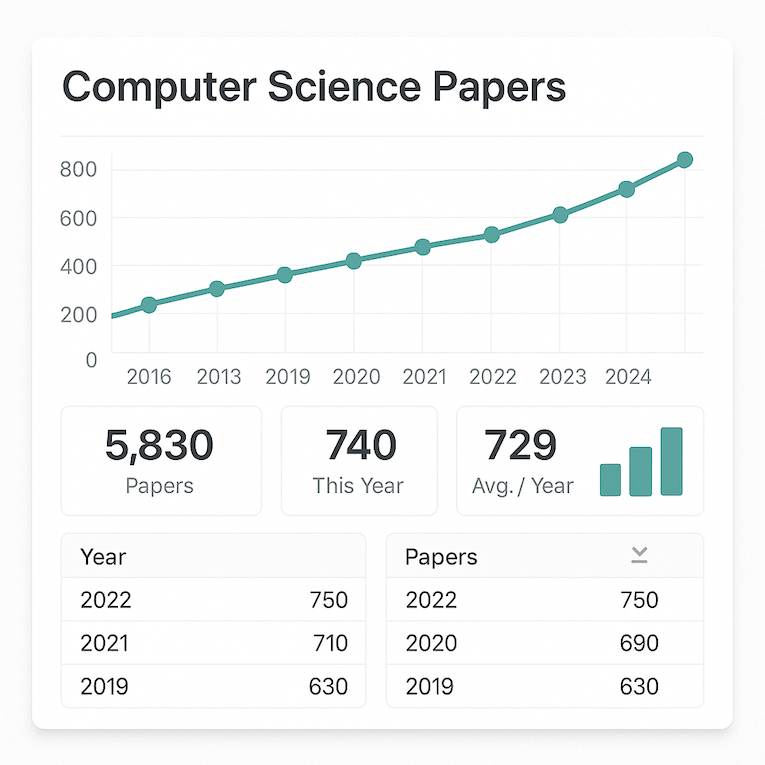

## Description

**Why this is important?** 

The field of computer science research is continually evolving, with new algorithms shaping the design of future hardware. This project aims to guide computer architecture decisions, ensuring that upcoming hardware aligns with the needs of software algorithms and applications. The dashboard you create can be of use to Arm partners manufacturing physical chips and used to guide architecture decisions.  

**Project Summary**

The main deliverable is a web scraping tool that pulls keywords from academic papers, considering the popularity of the paper and its publication. The data will be stored in an appropriate database and displayed in a web browser format, allowing users to visualize trends and changes in research focus over time. This project will provide practical experience in using APIs, web scraping, and data analysis. Some academic search engines to consider are Google Scholar, [BASE](https://www.base-search.net/), [Core](https://core.ac.uk/) and [Science.gov](https://science.gov/). 

## Prequisites

- Software: Intermediate understand of a scripting programming language (e.g., Python, JavaScript), web development and statistics.
- Hardware: Access to a computer with internet connectivity
- API access to scrape specific journal websites, you may need to obtain explicit permission from the website administrators or owners.

## Resources from Arm and our partners

- Learning path: [Deploy MariaDB on Arm servers](https://learn.arm.com/learning-paths/servers-and-cloud-computing/mariadb/))
- Learning path: [Learn how to deploy PostgresSQL](https://learn.arm.com/learning-paths/servers-and-cloud-computing/postgresql/)
- Software Libraries: Example libraries for web scraping are [BeautifulSoup](https://pypi.org/project/beautifulsoup4/), Selenium.

## Support Level

This project is designed to be self-serve but comes with opportunity of some community support from Arm Ambassadors, who are part of the Arm Developer program. If you are not already part of our program, [click here to join](https://www.arm.com/resources/developer-program?#register).

## Benefits 

Standout project contributions will result in preferential internal referrals to Arm Talent Acquisition (with digital badges for CV building).  And we are currently discussing with national agencies the potential for funding streams for Arm Developer Labs projects, which would flow to you, not us.

To receive the benefits, you must show us your project through our [online form](https://forms.office.com/e/VZnJQLeRhD). Please do not include any confidential information in your contribution. Additionally if you are affiliated with an academic institution, please ensure you have the right to share your material.