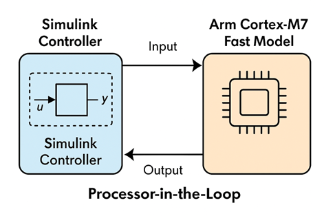

## Description

**Why this is important**

Modern automotive software development requires early verification of embedded software to meet performance and safety standards. Engineers must validate control algorithms long before physical ECUs are available. Processor in the Loop (PIL) verification bridges this gap by executing auto-generated embedded C code on a virtual processor while checking for functional equivalence and timing compliance. This challenge mirrors the real-world V-Model verification process used by OEMs and Tier 1 suppliers, offering hands-on experience in model-based design, embedded code generation, and in-the-loop testing on a virtual Arm Cortex M7 core.Modern vehicles demand rigorous, early-stage verification of embedded software to satisfy safety, performance and homologation requirements. Waiting for physical ECUs delays feedback and drives up cost; virtual processor testing closes this gap.

**Project summary**

Start with a prebuilt Simulink automotive control model and drive it through a complete model-based development and verification workflow. This includes defining detailed software requirements, designing test scenarios, generating C code from the controller subsystem, running processor-in-the-loop (PIL) tests on a virtual Arm Cortex M7 processor, analyzing execution time, and publishing a complete verification report.

## Prequisites

- [MATLAB & Simulink License](https://uk.mathworks.com/pricing-licensing.html?prodcode=ML&intendeduse=edu)
- Familiarity with C/C++, Simulink, Stateflow and Embedded Coder
- Familiarity with Processor-in-the-Loop (PIL), Code Profile Analyzer
- Understanding of automotive software development such as V-Model lifecycle methodology. 

## Resources from Arm and our partners

- Built-in Simulink Automotive Example: [Automatic Climate Control](https://www.mathworks.com/help/simulink/slref/simulating-automatic-climate-control-systems.html)
- Built-in Simulink Automotive Example: [Tire Pressure Monitoring System (TPMS)]( https://www.mathworks.com/help/simulink/ug/wirelesss-tire-pressure-monitoring-system-with-fault-logging.html)
- Built-in Simulink Automotive Example: [Anti-Lock Braking System (ABS)]( https://www.mathworks.com/help/simulink/slref/modeling-an-anti-lock-braking-system.html)
- Define Requirements: [Requirements Toolbox™](https://www.mathworks.com/products/requirements-toolbox.html)
- Code Generation: [MathWorks Embedded Coder®](https://uk.mathworks.com/products/embedded-coder.html)
- Model-in-the-Loop Test: [Simulink Test™](https://www.mathworks.com/help/sltest/index.html?s_tid=CRUX_lftnav)
- Measure Code Coverage: [Simulink Coverage™](https://www.mathworks.com/help/slcoverage/index.html) 
- Hardware Implementation: [Arm Cortex M7 (Fast Model)](https://developer.arm.com/Tools%20and%20Software/Fast%20Models), [Embedded Coder Support Package for Arm Cortex M Fast Models]( https://www.mathworks.com/hardware-support/arm-cortex-m.html)
- Conduct Execution Profiling: [Code Profile Analyzer](https://www.mathworks.com/help/ecoder/ref/codeprofileanalyzer-app.html) 
- Perform Static Code Analysis: [Polyspace®](https://www.mathworks.com/products/polyspace.html) 
- Documentation: [MATLAB and Simulink for Verification and Validation](https://www.mathworks.com/solutions/verification-validation.html)
- Documentation: [ARM Cortex-M Support from Embedded Coder]( https://www.mathworks.com/hardware-support/arm-cortex-m.html)
- Documentation: [Arm Fast Models](https://uk.mathworks.com/products/connections/product_detail/arm-fast-models.html)

## Support Level

This project is designed to be self-serve but comes with opportunity of some community support from Arm Ambassadors, who are part of the Arm Developer program. If you are not already part of our program, [click here to join](https://www.arm.com/resources/developer-program?#register).

## Benefits 

Standout project contributions will result in preferential internal referrals to Arm Talent Acquisition (with digital badges for CV building).  And we are currently discussing with national agencies the potential for funding streams for Arm Developer Labs projects, which would flow to you, not us.

To receive the benefits, you must show us your project through our [online form](https://forms.office.com/e/VZnJQLeRhD). Please do not include any confidential information in your contribution. Additionally if you are affiliated with an academic institution, please ensure you have the right to share your material.
