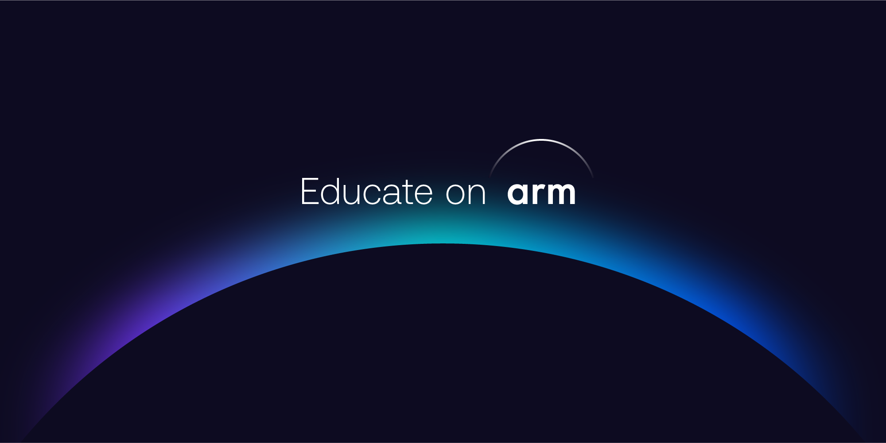

## Description
This undergraduate project aims to develop a simple voice assistant that can recognize spoken commands such as “turn on the light,” “play music,” and other similar tasks. The voice assistant will be able to control peripheral devices accordingly. The main objective is to implement your design on a low-power microcontroller Cortex-M55/U55 to create low-level machine learning applications. You should look to access metrics such as the accuracy, power and computation time. Please refer our [Machine Learning keyword spotting example](https://github.com/Arm-Examples/mlek-cmsis-pack-examples) as a reference. 

The deliverables include a functional voice assistant capable of understanding and executing basic commands, along with documentation detailing the development process and the performance of the system.

## Prequisites

- Languages: Python, C++, Embedded C
- Tooling: TensorFlow Lite for Microcontrollers, Keil MDK
- Hardware: Cortex-M55/U55 development board (or Corstone Virtual Platform), microphone, peripheral devices (e.g., lights, speakers)

## Resources from Arm and our partners

- Learning paths: [Navigating Machine Learning with Ethos-U processors](https://learn.arm.com/learning-paths/microcontrollers/nav-mlek/)
- Learning paths: [Tutorials on CMSIS](https://learn.arm.com/tag/cmsis/)
- Install Guide: [Keil Studio for VSCode](https://learn.arm.com/install-guides/keilstudio_vs/)
- Book: ["A beginner's Guide to Designing Embedded System Applications on Arm Cortex-M Microcontrollers"](https://www.arm.com/resources/education/books)
- Book: ["Arm Helium Technology M-Profile Vector Extensions (MVE)"](https://www.arm.com/resources/education/books)

## Support Level

This project is designed to be self-serve but comes with opportunity of some community support from Arm Ambassadors, who are part of the Arm Developer program. If you are not already part of our program, [click here to join](https://www.arm.com/resources/developer-program?#register).

## Benefits 

Standout project contributions will result in preferential internal referrals to Arm Talent Acquisition (with digital badges for CV building).  And we are currently discussing with national agencies the potential for funding streams for Arm Developer Labs projects, which would flow to you, not us.

To receive the benefits, you must show us your project through our [online form](https://forms.office.com/e/VZnJQLeRhD). Please do not include any confidential information in your contribution. Additionally if you are affiliated with an academic institution, please ensure you have the right to share your material.